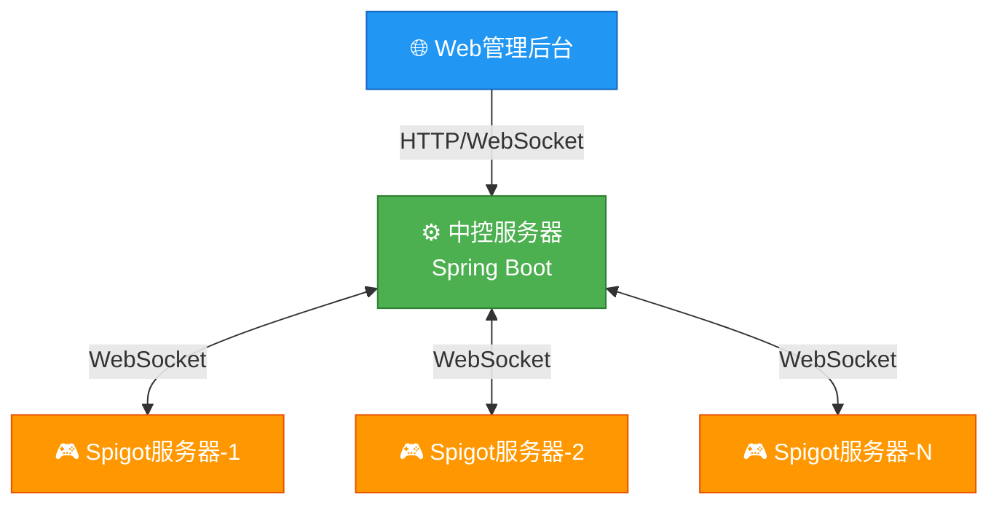

# PCS (Player Credit System) 🎮

<div align="center">

[](https://www.gnu.org/licenses/agpl-3.0)
[](https://www.minecraft.net/)
[](https://openjdk.org/)
[](https://spring.io/)

### 🌐 [English](README_EN.md) | [中文](README.md)

**Minecraft 跨服玩家信用管理系统**

*跨服务器玩家行为管理、信用评分、投票封禁一体化解决方案*

[📖 使用文档](#-使用方法) • [🛠️ 开发指南](#-本地化开发) • [🐛 问题反馈](../../issues)

</div>

---

## ⚠️ 重要警告

> 🚨 **请注意：这是一个"不建议使用"的版本！（已基本实现可用）**
>
> 由于开发过程中遭遇**数据丢失**，无奈发布了这个不人不鬼的版本。该版本存在以下问题：
> - 🐛 **BUG较多** - 代码质量和稳定性无法保证
> - 🤷 **版本混乱** - 部分功能实现不完整，许多问题作者也无法解答
> - ⚠️ **不建议生产环境使用** - 仅供测试和学习参考
>
> **建议使用场景**: 本地测试、学习研究、功能预览
> **不建议使用场景**: 生产服务器、重要数据环境

---

## 🛑 项目状态

> ⚠️ **该项目已被放弃，不再受到原作者的开发与维护**
>
> 本项目（PCS 1.0.1）已停止更新，不会修复任何BUG或添加新功能。
> 
> 本项目处于1.0.1到1.1.0版本的中间状态，算是是正在开发但还没完成的1.1.0版本吧...
> 
> 如需新功能或更好的稳定性，请关注 [PCS2](#-未来计划) 的开发进展。

---

## ✨ 功能特性

<table>
<tr>
<td width="50%">

### 🗳️ 跨服投票系统
- 支持 KICK / BAN / MUTE 三种操作
- 实时跨服务器广播
- 可配置的通过率和最少票数
- 自动化投票结果执行

### 📊 信用评分系统  
- 1-10分评分机制
- 带权重的信用算法
- 历史记录追溯
- 信用等级自动计算

</td>
<td width="50%">

### 🔒 安全与同步
- ECDH + AES-GCM 加密通信
- JWT Token 身份认证
- 跨服务器封禁同步
- WebSocket 实时通信

### 🎨 用户界面
- 箱子菜单 GUI 投票
- Web 管理后台
- 游戏内命令支持
- 响应式管理界面

</td>
</tr>
</table>

---

## 🏗️ 系统架构



---

## 📸 截图展示

> 🤔 **作者说**: 截图？下次一定！（其实就是懒）

<div align="center">

| 🖥️ Web管理后台 | 🎮 游戏内GUI | 📊 系统架构 |
|:---:|:---:|:---:|
|  |  |  |
| *Web管理界面* | *箱子菜单投票* | *系统架构图* |

</div>

> 💡 **提示**: 以上截图将在后续版本补充，欢迎提交 PR 添加您的使用截图！

---

## 📋 目录

- [📖 使用文档](#-使用方法)
  - [环境要求](#-环境要求)
  - [快速开始](#-快速开始)
  - [游戏内命令](#-游戏内命令)
- [🛠️ 本地化开发](#-本地化开发)
  - [开发环境](#-开发环境)
  - [构建项目](#-构建项目)
  - [项目结构](#-项目结构)
- [📄 许可证](#-许可证)
- [👤 作者信息](#-作者信息)

---

## 🚀 使用方法

### 📦 环境要求

| 组件 | 最低要求 | 推荐配置 |
|------|---------|---------|
| **中控服务器** | Java 21, 2GB RAM | Java 21, 4GB RAM |
| **游戏服务器** | Java 21, 2GB RAM | Java 21, 4GB RAM |
| **数据库** | H2 (内置) | MySQL 8.0+ |

### ⚡ 快速开始

#### 1️⃣ 构建并部署中控服务器

**请自行下载源码并构建：**

```bash
# 克隆仓库
git clone https://github.com/BaiJing88/Minecraft-Player-Credit-System.git
cd PCS

# 构建中控服务器
./gradlew :PCS-CentralController:build

# 运行
java -jar PCS-CentralController/build/libs/PCS-CentralController-1.0.0.jar

# 或使用脚本
# Windows: start-central-controller.bat
# Linux/Mac: ./start-central-controller.sh
```

**默认访问地址：**
- 🌐 Web管理后台: http://localhost:8080
- 🔌 WebSocket端口: ws://localhost:8080/ws/pcs

**默认管理员账号：**
```
用户名: admin
密码: admin123
```

> ⚠️ **安全提示**: 首次登录后请立即修改默认密码！

#### 2️⃣ 构建并配置游戏服务器

**构建 Spigot 插件：**

```bash
# 在 PCS 目录下
./gradlew :PCS-Spigot:build
```

将生成的 `PCS-Spigot-1.0.0.jar` 放入服务器的 `plugins/` 目录，配置文件会自动生成：

```yaml
# plugins/PCS-Spigot/config.yml
controllerHost: "localhost"
controllerPort: 8080
useSsl: false
serverId: "server-1"
serverName: "My Server"
apiKey: "your-api-key-here"

reconnect:
  enabled: true
  interval: 30
  maxRetries: 0
```

#### 3️⃣ 获取API密钥

1. 登录 Web 管理后台
2. 进入「系统配置」页面
3. 复制 API 密钥到客户端配置
4. 若您发现无法通过上述步骤获得API密钥，请查看中控程序配置文件！

#### 4️⃣ 启动游戏服务器

启动后会自动连接中控服务器，控制台将显示连接成功信息。

---

## 🎮 游戏内命令

### 玩家命令

| 命令 | 权限 | 描述 |
|:----:|:----:|:-----|
| `/pcs` | 所有人 | 显示帮助信息 |
| `/pcs vote` | 所有人 | 打开投票GUI界面 |
| `/pcs agree <ID>` | 所有人 | 同意进行中的投票 |
| `/pcs deny <ID>` | 所有人 | 反对进行中的投票 |
| `/pcs rate <玩家> <1-10>` | 所有人 | 给玩家评分 |
| `/pcs credit [玩家]` | 所有人 | 查询信用分数 |
| `/pcs history [玩家]` | 所有人 | 查看历史记录 |
| `/pcs banlist` | 所有人 | 查看封禁列表 |
| `/pcs gui` | 所有人 | 打开主GUI界面 |

---

## 🛠️ 本地化开发

### 🔧 开发环境

- **JDK**: 21 或更高版本 ([下载](https://openjdk.org/))
- **构建工具**: Gradle 8.8+
- **IDE**: IntelliJ IDEA (推荐)

### 📥 克隆项目

```bash
git clone https://github.com/BaiJing88/Minecraft-Player-Credit-System.git
cd PCS
```

### 🔨 构建项目

```bash
# 构建所有模块
./gradlew build

# 构建指定模块
./gradlew :PCS-CentralController:build
./gradlew :PCS-Spigot:build
```

**构建输出：**
- 中控: `PCS-CentralController/build/libs/PCS-CentralController-1.0.0.jar`
- Spigot: `PCS-Spigot/build/libs/PCS-Spigot-1.0.0.jar`

### 📁 项目结构

```
PCS/
├── 📦 PCS-API/                    # 公共API模块
│   ├── src/main/java/com/pcs/api/
│   │   ├── model/                 # 数据模型
│   │   ├── protocol/              # 通信协议
│   │   └── security/              # 加密工具
│   └── build.gradle
│
├── 🖥️ PCS-CentralController/      # 中控服务器
│   ├── src/main/java/com/pcs/central/
│   │   ├── controller/            # REST API控制器
│   │   ├── service/               # 业务逻辑
│   │   ├── websocket/             # WebSocket处理
│   │   └── security/              # 安全配置
│   ├── src/main/resources/static/ # Web前端
│   └── build.gradle
│
├── 🎮 PCS-Spigot/                 # Spigot插件
│   ├── src/main/java/com/pcs/spigot/
│   │   ├── command/               # 命令处理
│   │   ├── listener/              # 事件监听
│   │   ├── gui/                   # GUI界面
│   │   └── websocket/             # WebSocket客户端
│   └── build.gradle
│
├── 📜 LICENSE                     # AGPL v3许可证
├── 📖 README.md                   # 本文件
└── ⚙️ settings.gradle             # 项目配置
```

### 💾 数据库配置

中控默认使用 **H2** 嵌入式数据库。生产环境建议使用 **MySQL**：

```yaml
# config/application.yml
spring:
  datasource:
    url: jdbc:mysql://localhost:3306/pcsdb?useSSL=true
    username: pcsuser
    password: your-secure-password
    driver-class-name: com.mysql.cj.jdbc.Driver
```

---

## 📄 许可证

```
Copyright (c) 2026 Bai_Jing88 (QQ: 1782307393)
```

本项目采用 **GNU Affero General Public License v3 (AGPL v3)** 开源许可。

### 📋 许可证条款

| 许可项 | 状态 | 说明 |
|:------:|:----:|:-----|
| 个人使用 | ✅ 允许 | 个人服务器使用 |
| 修改 | ✅ 允许 | 可以修改源代码 |
| 分发 | ✅ 允许 | 可以重新分发 |
| 开源衍生作品 | ✅ 必须 | 修改后必须开源 |
| 商业用途 | ❌ 禁止 | 未经书面许可不得商用 |
| 保留版权声明 | ✅ 必须 | 必须保留版权声明 |

详见 [LICENSE](LICENSE) 文件。

---

## 👤 作者信息

<div align="center">

**Bai_Jing88**

[](http://wpa.qq.com/msgrd?v=3&uin=1782307393)

© 2026 Bai_Jing88. All Rights Reserved.

</div>

---

## 🔮 未来计划

### PCS2 开发预告

> 🎉 **重磅消息！** 作者计划在 **2026年下半年** 完全重写该项目！
>
> 新项目名称：~~Player Credit System Pro Max Plus Ultra Premium Elite Advanced Extreme Deluxe~~ 
>
> 其实真名是：**Player Credit System 2 (PCS2)** 😄

**PCS2 计划特性：**
- 🚀 全新的架构设计
- 📱 移动端管理APP
- 🤖 AI辅助玩家行为分析
- 🌐 支持更多游戏平台
- ⚡ 性能大幅提升
- 超多想法，此处不再体现

*敬请期待！（如果作者没有鸽的话）*

---

## ⚠️ 免责声明

- "**Minecraft**" 是 [Mojang Studios](https://www.minecraft.net/) 的商标
- 本项目与 **Mojang Studios** 或 **Microsoft** 无任何关联
- 使用本项目产生的任何问题由使用者自行承担

---

<div align="center">

## ⭐ Star History

如果这个项目对你有帮助，请给我们一个 **Star**！

[](https://star-history.com/#BaiJing88/PCS&Date)

---

**[⬆ 回到顶部](#pcs-player-credit-system-)**

</div>
