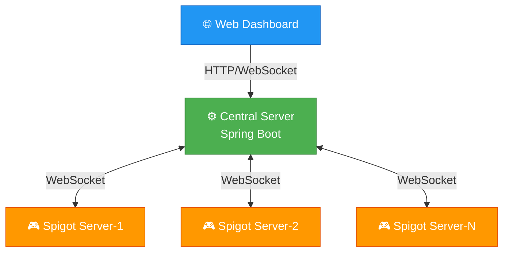

# PCS (Player Credit System) 🎮

<div align="center">

[](https://www.gnu.org/licenses/agpl-3.0)
[](https://www.minecraft.net/)
[](https://openjdk.org/)
[](https://spring.io/)

### 🌐 [English](README_EN.md) | [中文](README.md)

**Minecraft Cross-Server Player Credit Management System**

*An integrated solution for cross-server player behavior management, credit scoring, and voting bans*

[📖 Documentation](#-usage) • [🛠️ Development](#-local-development) • [🐛 Issue Report](../../issues)

</div>

---

## ⚠️ Important Warning

> 🚨 **Please Note: This is a "not recommended for use" version! (Basically usable)**
>
> Due to **data loss** during development, this incomplete version was released reluctantly. This version has the following issues:
> - 🐛 **Many Bugs** - Code quality and stability cannot be guaranteed
> - 🤷 **Version Confusion** - Some features are incomplete, and many issues cannot be answered by the author
> - ⚠️ **Not Recommended for Production** - For testing and learning purposes only
>
> **Recommended Use Cases**: Local testing, research/study, feature preview
> **Not Recommended For**: Production servers, important data environments

---

## 🛑 Project Status

> ⚠️ **This project has been abandoned and is no longer developed or maintained by the original author.**
>
> This project (PCS 1.0.1) has stopped receiving updates. No bugs will be fixed and no new features will be added.
>
> This project is in an intermediate state between version 1.0.1 and 1.1.0 - it's a 1.1.0 version that's still in development but not yet completed...
>
> For new features or better stability, please follow the development of [PCS2](#-future-plans).

---

## ✨ Features

<table>
<tr>
<td width="50%">

### 🗳️ Cross-Server Voting System
- Support KICK / BAN / MUTE operations
- Real-time cross-server broadcasting
- Configurable pass rate and minimum votes
- Automated vote result execution

### 📊 Credit Rating System  
- 1-10 point rating mechanism
- Weighted credit algorithm
- Historical record tracking
- Automatic credit level calculation

</td>
<td width="50%">

### 🔒 Security & Synchronization
- ECDH + AES-GCM encrypted communication
- JWT Token authentication
- Cross-server ban synchronization
- WebSocket real-time communication

### 🎨 User Interface
- Chest menu GUI voting
- Web management dashboard
- In-game command support
- Responsive admin interface

</td>
</tr>
</table>

---

## 🏗️ System Architecture



---

## 📸 Screenshots

> 🤔 **Author says**: Screenshots? Coming next time! (Actually just lazy)

<div align="center">

| 🖥️ Web Dashboard | 🎮 In-Game GUI | 📊 Architecture |
|:---:|:---:|:---:|
|  |  |  |
| *Web Management* | *Chest Menu Voting* | *System Architecture* |

</div>

> 💡 **Note**: Screenshots will be added in future updates. PRs with usage screenshots are welcome!

---

## 📋 Table of Contents

- [📖 Usage](#-usage)
  - [Requirements](#-requirements)
  - [Quick Start](#-quick-start)
  - [In-Game Commands](#-in-game-commands)
- [🛠️ Local Development](#-local-development)
  - [Development Environment](#-development-environment)
  - [Build Project](#-build-project)
  - [Project Structure](#-project-structure)
- [📄 License](#-license)
- [👤 Author Info](#-author-info)

---

## 🚀 Usage

### 📦 Requirements

| Component | Minimum | Recommended |
|-----------|---------|-------------|
| **Central Server** | Java 21, 2GB RAM | Java 21, 4GB RAM |
| **Game Server** | Java 21, 2GB RAM | Java 21, 4GB RAM |
| **Database** | H2 (Built-in) | MySQL 8.0+ |

### ⚡ Quick Start

#### 1️⃣ Build and Deploy Central Server

**Please download the source code and build it yourself:**

```bash
# Clone repository
git clone https://github.com/BaiJing88/PCS.git
cd PCS

# Build central server
./gradlew :PCS-CentralController:build

# Run
java -jar PCS-CentralController/build/libs/PCS-CentralController-1.0.0.jar
```

**Default Access:**
- 🌐 Web Dashboard: http://localhost:8080
- 🔌 WebSocket Port: ws://localhost:8080/ws/pcs

**Default Admin Account:**
```
Username: admin
Password: admin123
```

> ⚠️ **Security Tip**: Please change the default password immediately after first login!

#### 2️⃣ Build and Configure Game Server

**Build Spigot plugin:**

```bash
# In PCS directory
./gradlew :PCS-Spigot:build
```

Place the generated `PCS-Spigot-1.0.0.jar` in the server's `plugins/` directory, config file will be auto-generated:

```yaml
# plugins/PCS-Spigot/config.yml
controllerHost: "localhost"
controllerPort: 8080
useSsl: false
serverId: "server-1"
serverName: "My Server"
apiKey: "your-api-key-here"

reconnect:
  enabled: true
  interval: 30
  maxRetries: 0
```

#### 3️⃣ Get API Key

1. Login to Web Dashboard
2. Navigate to "System Config" page
3. Copy API Key to client configuration
4. If you cannot obtain the API key through the above steps, please check the central server configuration file!

#### 4️⃣ Start Game Server

The server will automatically connect to the central server upon startup.

---

## 🎮 In-Game Commands

### Player Commands

| Command | Permission | Description |
|:-------:|:----------:|:------------|
| `/pcs` | Everyone | Show help information |
| `/pcs vote` | Everyone | Open voting GUI |
| `/pcs agree <ID>` | Everyone | Agree to ongoing vote |
| `/pcs deny <ID>` | Everyone | Disagree to ongoing vote |
| `/pcs rate <player> <1-10>` | Everyone | Rate a player |
| `/pcs credit [player]` | Everyone | Check credit score |
| `/pcs history [player]` | Everyone | View history records |
| `/pcs banlist` | Everyone | View ban list |
| `/pcs gui` | Everyone | Open main GUI |

---

## 🛠️ Local Development

### 🔧 Development Environment

- **JDK**: 21 or higher ([Download](https://openjdk.org/))
- **Build Tool**: Gradle 8.8+
- **IDE**: IntelliJ IDEA (Recommended)

### 📥 Clone Project

```bash
git clone https://github.com/BaiJing88/PCS.git
cd PCS
```

### 🔨 Build Project

```bash
# Build all modules
./gradlew build

# Build specific module
./gradlew :PCS-CentralController:build
./gradlew :PCS-Spigot:build
```

**Build Output:**
- Central: `PCS-CentralController/build/libs/PCS-CentralController-1.0.0.jar`
- Spigot: `PCS-Spigot/build/libs/PCS-Spigot-1.0.0.jar`

### 📁 Project Structure

```
PCS/
├── 📦 PCS-API/                    # Common API Module
│   ├── src/main/java/com/pcs/api/
│   │   ├── model/                 # Data Models
│   │   ├── protocol/              # Communication Protocol
│   │   └── security/              # Encryption Utils
│   └── build.gradle
│
├── 🖥️ PCS-CentralController/      # Central Server
│   ├── src/main/java/com/pcs/central/
│   │   ├── controller/            # REST API Controllers
│   │   ├── service/               # Business Logic
│   │   ├── websocket/              # WebSocket Handlers
│   │   └── security/              # Security Config
│   ├── src/main/resources/static/  # Web Frontend
│   └── build.gradle
│
├── 🎮 PCS-Spigot/                 # Spigot Plugin
│   ├── src/main/java/com/pcs/spigot/
│   │   ├── command/               # Command Handlers
│   │   ├── listener/              # Event Listeners
│   │   ├── gui/                   # GUI Interfaces
│   │   └── websocket/             # WebSocket Client
│   └── build.gradle
│
├── 📜 PCS-Fabric/                  # Fabric Mod
├── 📜 PCS-Forge/                   # Forge Mod
├── 📜 PCS-NeoForge/                # NeoForge Mod
│
├── 📜 LICENSE                      # AGPL v3 License
├── 📖 README.md                     # This File
└── ⚙️ settings.gradle              # Project Config
```

### 💾 Database Configuration

The central server uses **H2** embedded database by default. For production, **MySQL** is recommended:

```yaml
# PCS-CentralController/config/application.yml
spring:
  datasource:
    url: jdbc:mysql://localhost:3306/pcsdb?useSSL=true
    username: pcsuser
    password: your-secure-password
    driver-class-name: com.mysql.cj.jdbc.Driver
```

---

## 📄 License

```
Copyright (c) 2026 Bai_Jing88 (QQ: 1782307393)
```

This project is licensed under the **GNU Affero General Public License v3 (AGPL v3)**.

### 📋 License Terms

| Term | Status | Description |
|:----:|:------:|:------------|
| Personal Use | ✅ Allowed | Use on personal servers |
| Modification | ✅ Allowed | Can modify source code |
| Distribution | ✅ Allowed | Can redistribute |
| Open Source Derivatives | ✅ Required | Must open source after modification |
| Commercial Use | ❌ Prohibited | Commercial use requires written permission |
| Attribution | ✅ Required | Must retain copyright notice |

See [LICENSE](LICENSE) file for details.

---

## 👤 Author Info

<div align="center">

**Bai_Jing88**

[](http://wpa.qq.com/msgrd?v=3&uin=1782307393)

© 2026 Bai_Jing88. All Rights Reserved.

</div>

---

## 🔮 Future Plans

### PCS2 Development Preview

> 🎉 **Big News!** The author plans to completely rewrite this project in **H2 2026**!
>
> New project name: ~~Player Credit System Pro Max Plus Ultra Premium Elite Advanced Extreme Deluxe~~
>
> Actually the real name is: **Player Credit System 2 (PCS2)** 😄

**Planned PCS2 Features:**
- 🚀 Brand new architecture design
- 📱 Mobile management APP
- 🤖 AI-assisted player behavior analysis
- 🌐 Support for more game platforms
- ⚡ Significant performance improvements
- Many more ideas, not listed here

*Stay tuned! (If the author doesn't procrastinate)*

---

## ⚠️ Disclaimer

- "**Minecraft**" is a trademark of [Mojang Studios](https://www.minecraft.net/)
- This project is **NOT** affiliated with **Mojang Studios** or **Microsoft**
- Users assume all responsibility for using this project

---

<div align="center">

## ⭐ Star History

If this project helps you, please give us a **Star**!

[](https://star-history.com/#BaiJing88/PCS&Date)

---

**[⬆ Back to Top](#pcs-player-credit-system-)**

</div>
